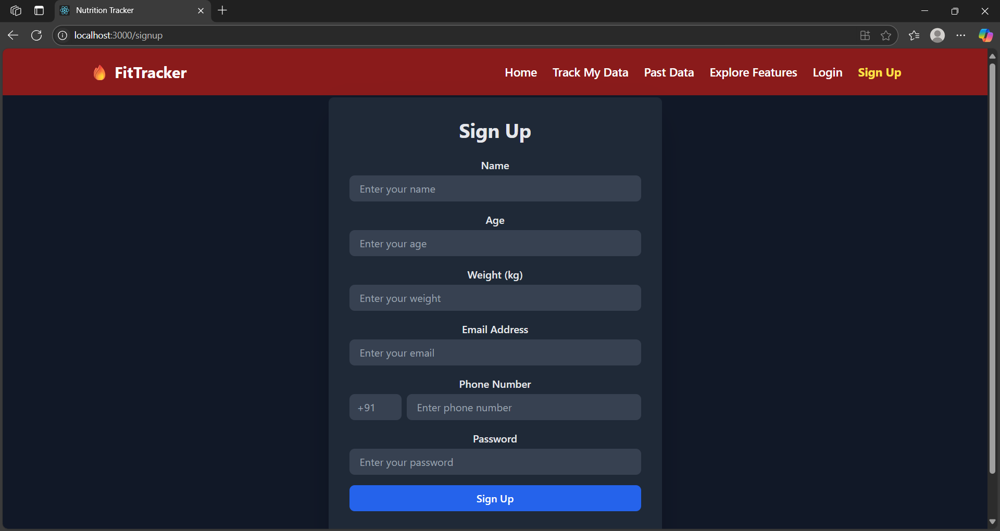
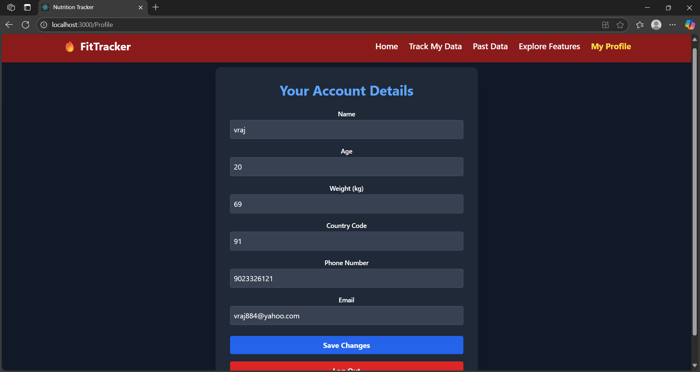
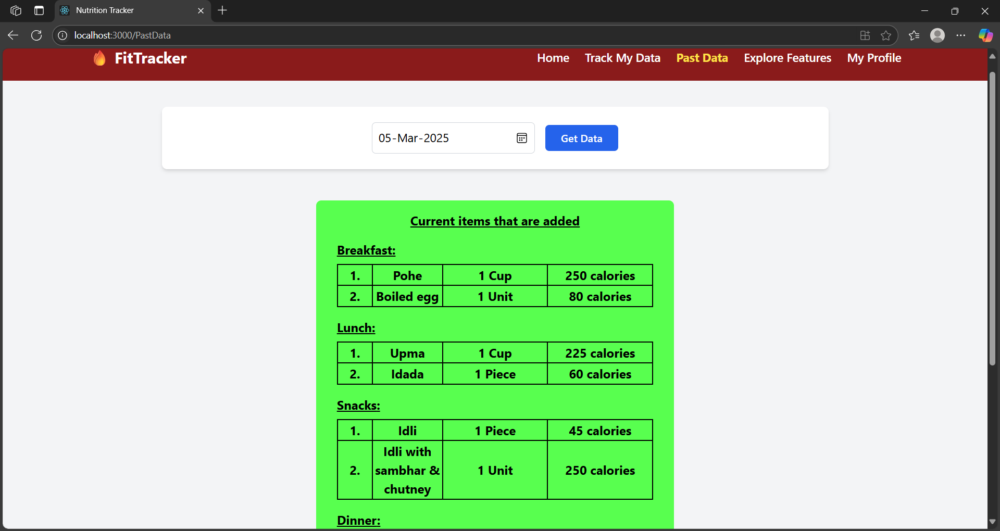
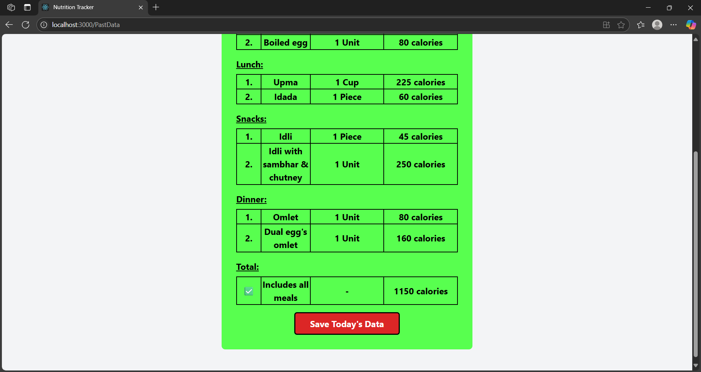
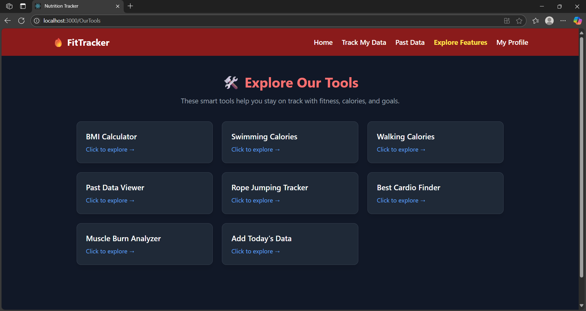

# 🥗 FitTrack | Fullstack Fitness Tracker (React + Express + MongoDB)

FitTrack is a fullstack fitness tracker web app that allows users to sign up, log in, track daily meal calories, view past records, and access built-in fitness tools — all through an intuitive interface. Built using **React.js** for the frontend and **Express.js + MongoDB** for the backend.

---

## 🏗️ Project Structure

```
📦 FitTrack
├── 📁 recordbook   # React.js Frontend
└── 📁 server       # Express.js + MongoDB Backend
```

---

## 🚀 How to Run the Project Locally

### 1. Clone the Repository

```bash
git clone https://github.com/Vraj884/FitTrack.git
cd FitTrack
```

### 2. Start the Backend (Express + MongoDB)

```bash
cd server
npm install
```

#### 🔑 Create `.env` in `/server`:

```
PORT=8000
MONGO_URI_CLIENT=mongodb://localhost:27017/client
MONGO_URI_ADMIN=mongodb://localhost:27017/adminDB
```

```bash
npm start
```

### 3. Start the Frontend (React)

```bash
cd ../recordbook
npm install
npm run dev  # or npm start
```

📌 Make sure the backend is running at `http://localhost:8000`

---

## 🧩 Backend API Overview (`/server`)

### 👤 User Routes (`/api/user`)
| Method | Endpoint     | Description             |
|--------|--------------|-------------------------|
| POST   | `/signup`    | Register new user       |
| POST   | `/login`     | Authenticate user       |

### 🍽️ Calories Routes (`/api/calories`)
| Method | Endpoint     | Description                 |
|--------|--------------|-----------------------------|
| POST   | `/update`    | Add or update calorie data  |
| POST   | `/read`      | Read calorie data           |

---

## 🧠 Backend Schema Overview

### User Schema

```js
{
  name: String,
  age: Number,
  weight: Number,
  email: String,
  phoneNo: String,
  countryCode: String,
  password: String
}
```

### Calories Schema

```js
{
  date: String,
  user: String,
  breakfast: [meal],
  lunch: [meal],
  snacks: [meal],
  dinner: [meal]
}

meal = {
  Dish: String,
  Quantity: Number,
  PlateType: String,
  calories: Number
}
```

✔️ `user + date` combination is **uniquely indexed** to avoid duplicate entries.

---

## 🧠 Frontend Features (`/recordbook`)

### 📄 Pages

| Route         | Description                                 |
|---------------|---------------------------------------------|
| `/signup`     | Register user                               |
| `/login`      | Login user and save to Redux + localStorage |
| `/profile`    | View/Edit personal data                     |
| `/TrackMyData`| Input meals and track calories              |
| `/PastData`   | Select date and view saved meal entries     |
| `/OurTools`   | Explore BMI + workout tools                 |

### 📌 Highlights

- 🔐 Protected Routes using Redux `user.loggedIn`
- 🧠 Fitness Tools: BMI, swimming, walking, muscle training calculators
- 📅 Track calorie intake for each meal per day
- 📊 View meal history using date selector
- 🗳️ Poll system with localStorage vote limit
- 💅 Built with **Tailwind CSS** for responsive UI

---

## 🛠️ Tech Stack

### 🔧 Frontend

- React 18+
- Redux Toolkit
- React Router DOM
- Tailwind CSS
- Authentication (Basic)

### 🔧 Backend

- Express.js
- MongoDB + Mongoose
- CORS
- dotenv
- Modularized route/controller/model structure

---

## 🖼️ Screenshots

### 🔐 Protected Routes


### 👤 Signup Form


### 🧾 Profile Page


### 🍽️ Meal Tracking - Example 1


### 🍽️ Meal Tracking - Example 2


### 🛠️ Tools Dashboard


---

## ⚠️ Notes

- App is **not JWT based** — it uses simple credential verification
- Make sure to **replace hardcoded credentials/API keys** before deploying
- MongoDB must be running locally on default ports unless otherwise configured

---

## 📜 License

[MIT](LICENSE)

---

## ✨ Author

Made with ❤️ by **Vraj Patel**
