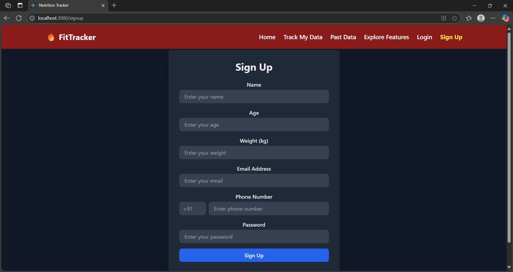
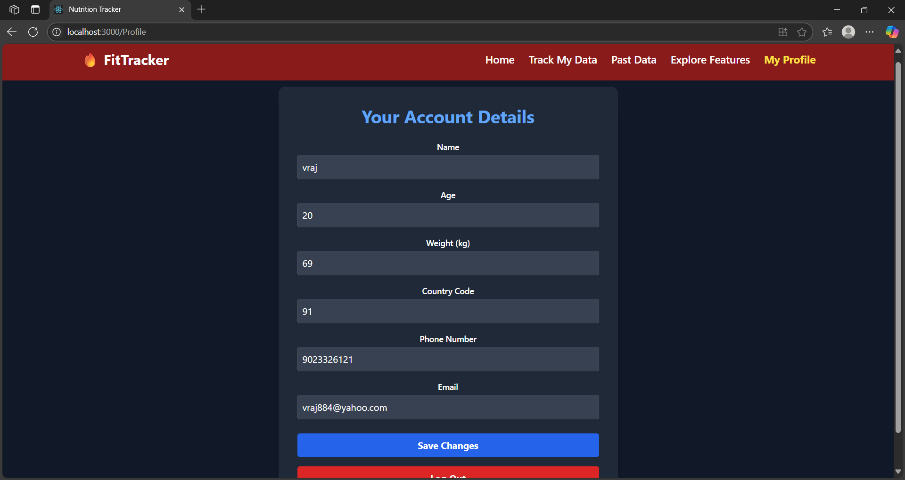
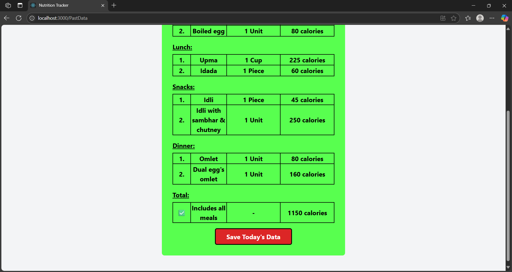

# 💪 FitTrack | Fitness Tracker Frontend

FitTrack is a responsive fitness tracker web application frontend built with **React.js**, **Redux**, and **Tailwind CSS**, designed to help users Calculate their workout's outcome, Track calories for each meal, visualize past data, and more. This app allows user authentication, data tracking, and fitness tool exploration, all via an intuitive UI.

---

## 🌐 Live Features

* 🔐 **User Authentication** (Signup/Login/Profile)
* 📅 **Track My Data** (Meal Input, Daily Entry)
* 📊 **Past Data Viewing** (With Date Selector)
* 🧠 **Fitness Tools**

  * BMI Calculator
  * Calories Burned by Swimming, Walking, Rope Jumping, Muscle Training (Many more)
  * Suggest Best Cardio/Muscle Exercise

---

## 📁 Folder Structure

```
src/
├── components/
│   ├── Nav.jsx
│   ├── Profile.jsx
│   ├── SignUp.jsx
│   ├── Login.jsx
│   ├── ReadData.jsx
│   ├── OurTools.jsx
│   ├── MealSelection.jsx
│   └── Day.jsx
├── RTK/
│   └── userSlice.js
├── App.js
├── index.js
```

---

## 🛠 Technologies Used

* **React.js** (18+)
* **Redux Toolkit** for global user state
* **React Router DOM** for page routing
* **Tailwind CSS** for UI styling
* **LocalStorage** for vote persistence and auth cache

---

## 🚀 How to Run Locally


### 1. Install Dependencies

```bash
npm install
```

### 2. Start the App

```bash
npm run dev  # or npm start
```

### 3. Backend Requirement

This app depends on a backend at:

```
http://localhost:8000
```

> ⚠️ Make sure your Express.js backend (with MongoDB) is running and CORS-enabled.

---

## 📝 Authentication Details

* Signup stores user data and redirects to login.
* Login saves user session to Redux and localStorage.
* Profile page allows updates and logout.

> ❗ Not JWT based. Simple login logic that checks MongoDB credentials.

---

## ⚙️ Pages Overview

### `/signup`

* User signs up with age, weight, phone, email, password.
* Validations on age, weight, phone.

### `/login`

* Verifies email and password via backend.
* Sets Redux state.

### `/Profile`

* Editable user data view.
* Logout option.

### `/TrackMyData`

* Users input meal types (breakfast, lunch, etc.).
* Quantity selector and calorie calculation.

### `/PastData`

* Select a previous date.
* Shows saved meals using `<Day />` component.

### `/OurTools`

* Lists available tools (BMI, muscle training, etc.) with links.
* Fully responsive table.

---

## 🧠 Notes for Developers

* All features are **modularized** and **independent**.
* Each component uses `useSelector` and `useDispatch` for state.
* Use `localStorage.getItem("Authentication")` to keep user logged in on refresh.
* Backend should expose `/signup`, `/login`, `/ReadData`, `/TrackMyData` endpoints.

---

## 🧪 Testing

* ✅ Manual form validation testing
* ✅ Meal entry tested with image loading
* ✅ Redux user state persists
* ✅ Route guarding via `user.loggedIn`

---

## 💡 Tips

* 🗝️ Use your own API keys or credentials if needed.
* 🎨 Tailwind is used throughout; responsive tweaks are built-in.
* 🧼 Clear localStorage to reset voting/authentication.

---

## 📸 Screenshots

## 🔐 Protected Routes


---

## 👤 Signup Form



---

## 🧾 Profile Page



---

## 🍽️ Meal Tracking - Example 1


---

## 🍽️ Meal Tracking - Example 2



---

## 🛠️ Tools Dashboard


---

## 🤝 Contributing

Pull requests are welcome. For major changes, please open an issue first to discuss what you would like to change.

---

## 📜 License

[MIT](https://choosealicense.com/licenses/mit/)

---

## 📩 Contact

**Made with ❤️ by Vraj Patel**
